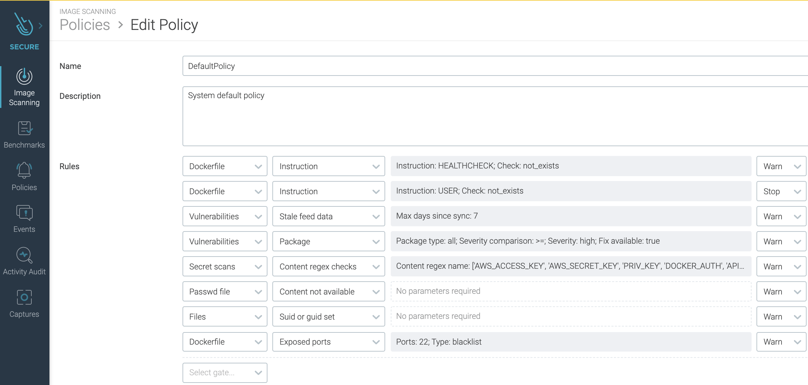
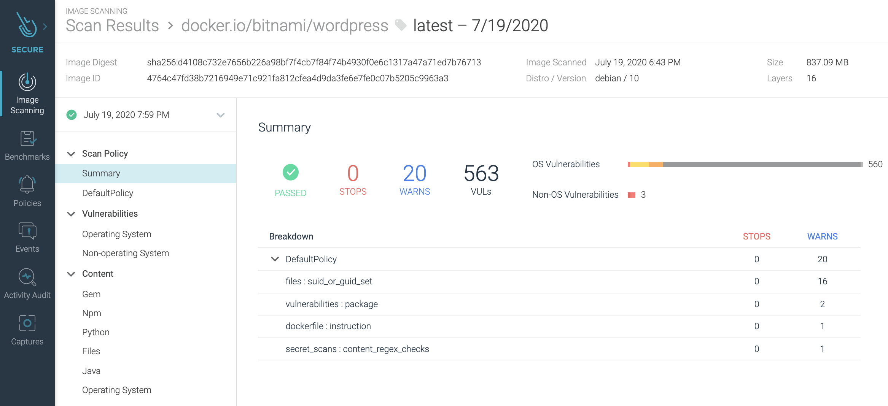
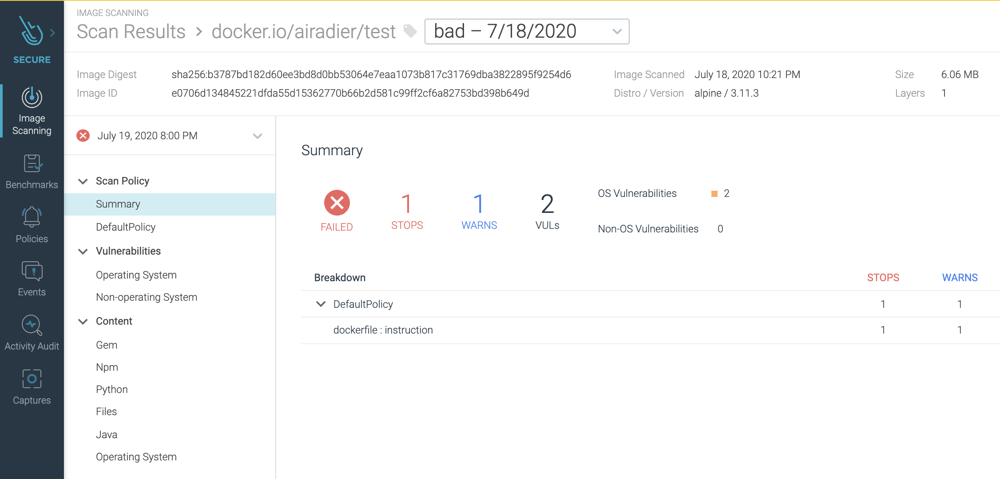

== Sysdig OPA Image Scanner on OpenShift 4.5.2+

Video at https://bit.ly/marcredhatopa

----
The Sysdig OPA Image Scanner registers as a dynamic admission controller plugin and intercepts 
the creation, or update of Pods, in the cluster. 

When a Pod resource is intercepted, the controller performs several steps for every container inside the pod:

It triggers a scan of the image used for that container.

It modifies (mutates) the pod definition by changing the tag of the image and replacing it with the @sha256:digest, 
so the image is selected by digest and not by tag.

It retrieves the scan report of the image.

It evaluates the scan report and the admission review context using a set of OPA rules that can be modified and extended if required.

Source: https://sysdig.com/blog/image-scanning-admission-controller/
See also:
https://sysdig.com/blog/kubernetes-admission-controllers/
https://sysdiglabs.github.io/sysdig-admission-controller/
----

----
For details on how to fully automate the installation of OpenShift 4.5 (for lab/test purposes)
on a baremetal server with KVM/libvirt,
please see https://github.com/marcredhat/z/blob/master/zdt.adoc, starting at the
"Install OpenShift 4" paragraph
----

----
oc version && printf "Helm " && helm version
Client Version: 4.5.2
Server Version: 4.5.2
Kubernetes Version: v1.18.3+b74c5ed
Helm version.BuildInfo{Version:"v3.2.4", GitCommit:"0ad800ef43d3b826f31a5ad8dfbb4fe05d143688", GitTreeState:"clean", GoVersion:"go1.13.12"}
----

----
To install helm on RHEL 8, see https://github.com/marcredhat/workshop/tree/master/helm
----

----
wget https://raw.githubusercontent.com/sysdiglabs/charts/master/charts/sysdig-admission-controller/values.yaml
----

I'm using https://github.com/marcredhat/sysdig/blob/master/values.yaml

NOTE: I set verboseLog: true and reportPending: accept

----
oc new-project  sysdig-admission-controller
helm repo add sysdiglabs https://sysdiglabs.github.io/charts/

#Check "Chart Versions" at https://hub.helm.sh/charts/sysdiglabs/sysdig-admission-controller
helm install -n sysdig-admission-controller sysdig-admission-controller -f values.yaml sysdiglabs/sysdig-admission-controller --version 1.1.5
----

----

git clone https://github.com/sysdiglabs/image-scanning-admission-controller.git
cd image-scanning-admission-controller
export ANCHORE_CLI_URL="https://api.sysdigcloud.com/api/scanning/v1/anchore"
export ANCHORE_CLI_USER="<Sysdig Secure API Token>"
vim ./scripts/deploy.sh; replace kubectl with oc
vim ./scripts/clean.sh; replace kubectl with oc
make deploy
----

== Define Sysdig Scanning Policies

== Deploy a good image and check the Sysdig Admission Controller's activity

----
#!/usr/bin/env bash
oc project goodimages
oc delete deploy --all
oc create deployment test-dep4 --image=docker.io/bitnami/wordpress
sysdigadmissioncontroller=`oc get pods -n  sysdig-admission-controller | tail -1 | awk '{print $1}'`
oc logs $sysdigadmissioncontroller -n sysdig-admission-controller --follow | grep bitnami
----

----
Result:
admissionevaluatorimpl.go:68 Scan check for admission review 5be04fdb-f8e7-4bf3-8e18-d3c0e77b2c20 
ALLOWED container 'wordpress' image 'docker.io/bitnami/wordpress'
mutationhook.go:71] [mutation-server] Patching container image: docker.io/bitnami/wordpress -> docker.io/bitnami/wordpress@sha256:d4108c732e7656b226a98bf7f4cb7f84f74b4930f0e6c1317a47a71ed7b76713
----

== Deploy a bad image and check the Sysdig Admission Controller's activity

----
oc project badimages
oc delete deploy --all
oc create deployment badimage --image=docker.io/airadier/test:bad
sysdigadmissioncontroller=`oc get pods -n  sysdig-admission-controller | tail -1 | awk '{print $1}'`
oc logs $sysdigadmissioncontroller -n sysdig-admission-controller --follow | grep bad
----

----
Result:
Admission review 9833f912-5875-4cfb-8459-aa91677ad88f - pod 'badimage-b744db485-*' REJECTED. Reasons:
Image 'docker.io/airadier/test:bad' for container 'test' failed scan policy check: REJECTED. Global default policy - scan result is 'reject'
I0720 03:03:59.601996       1 mutationhook.go:71] [mutation-server] Patching container image: docker.io/airadier/test:bad -> docker.io/airadier/test@sha256:b3787bd182d60ee3bd8d0bb53064e7eaa1073b817c31769dba3822895f9254d6 "value": "bad"
----

